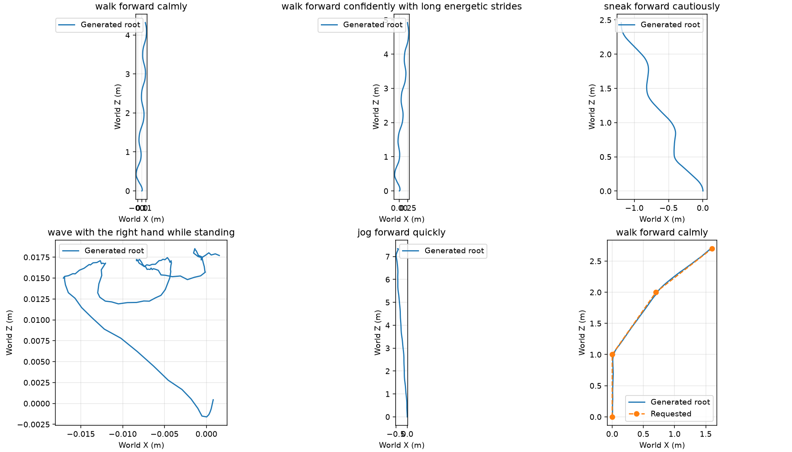
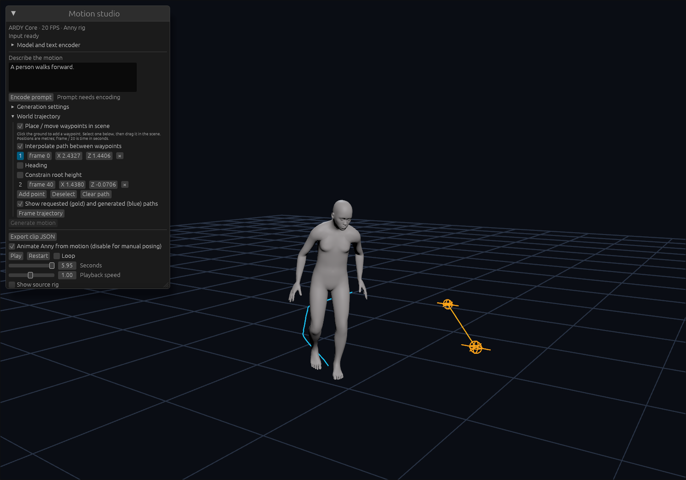

# ARDY implementation evidence — 2026-09-26

Historical first-pass measurements. The host text encoder and incomplete
SOMA/GEM UI described below have been replaced by local Rust/Burn inference.
See [portable qualification](../portable-2026-09-26/) for the current Llama,
SOMA, GEM-X and viewer results. The ARDY checkpoint and Anny retargeting
measurements here remain useful; the earlier application boundaries do not
describe the current implementation.

The actual NVIDIA Core RP checkpoint was converted twice, loaded on CPU,
native WGPU and Chrome WebGPU, and compared with pinned upstream PyTorch
outputs. The viewer also completed prompt encoding, generation on Bevy's shared
WebGPU device, Anny playback, and clip export. No model weights are committed.
Reproduction commands and support boundaries are in [the motion guide](../../motion.md).

## Environment and artifacts

- Linux, NVIDIA RTX PRO 6000 Blackwell Workstation Edition, driver 610.43.02.
- Burn 0.21.0, Bevy 0.19.1, one resolved wgpu 29.0.4; no dependency patches.
- Chrome headless shell 153.0.8010.12, hardware WebGPU (`nvidia` / `blackwell`).
- ARDY source `693f74d13b3d04a0a22ce127ee79c929dd89756b` and checkpoint
  `abe6c43beb28c867c950acb824b9c4ef3d63fb76`.
- ONNX text export `7aa52a05d54c2fd9177366aeb3f88e9e7f3c5766` from
  [TREE Industries](https://huggingface.co/TREEIndustries/Llama-3-ARDY-Text-Encoder-ONNX).
- Manifest `b7905f24ed6b9c9a3fa08c622312a1ad7f843ce4fa818632c592d3ad0041ef5d`:
  428 tensors, 41 logical objects, 59 physical parts, 765,068,032 object bytes.
  Parts are at most 20 MiB and logical objects at most 33,601,024 bytes.
  Repeated conversion produced byte-identical manifests and parts. Repeated
  reference export produced byte-identical configuration and numeric fixtures.

## Numerical checks and measured throughput

| Measurement | Native WGPU | Chrome WebGPU |
|---|---:|---:|
| Maximum denoiser absolute error | 0.0000304 | 0.0000814 |
| Maximum DDIM absolute error | 0.000183 | 0.000154 |
| Maximum decoder absolute error | 0.000260 | 0.000703 |
| Maximum FK coordinate error | 0.000000477 m | 0.000000477 m |
| One request, generated frames/second | 106.5 | 186.0–206.5 |
| Four requests, total generated frames/second | 357.2 | 663.4–718.8 |

These are three warm-kernel trials per run on this workstation, with complete
output readback: 10 DDIM steps, 40 generated frames, eight history and eight
future frames. CFG processes three branches per request. Timings exclude model
loading, motion decoding, text encoding and rendering. They are throughput
measurements of the sampler, not end-to-end application frame rates. The browser
range is from separate cold-cache and warm-cache page loads. Native and browser
kernel choices can differ. All four batched outputs were checked against the
same fixture. CPU ndarray also passed the numerical checks.

Browser model loading took 13.41 seconds cold and 9.19 seconds with cached
parts. The cold load requested 59 model parts; the warm load requested zero.
Peak observed WASM linear memory was 238.69 MiB in both runs. This excludes
JavaScript heap and GPU memory; all F32 weights remain GPU resident.
An additional full-model cache test fetched exactly one part after corrupting
one cache entry and still passed every numerical hook. Separate fault injection
checks passed for unavailable cache reads/open/writes, bounded response reads,
and rejection of corrupt network data; see [cache recovery](browser-cache-recovery.json)
and [transport failures](browser-transport.json).

The ONNX CUDA encoder matched token IDs/masks for all five supplied reference
prompts. Embedding cosines were 0.9773–0.9824 against its provided FP16
references, exceeding the declared 0.97 threshold. Warm median encode time was
22.57 ms with profiling enabled. Provider profiling recorded CUDA execution,
including quantized matrix multiplies. Llama runs in the optional host service;
it is not a browser Burn model. Built with Meta Llama 3.

## Motion and rig diagnostics

Six seed-42 clips contain 120 frames each: calm walk, energetic walk, sneak,
standing wave, jog, and a constrained curved path. The gross response gates
passed: travel ordered sneak < calm < energetic < jog, standing wave travelled
0.074 m, and the path's waypoint RMSE was 0.0247 m versus 1.203 m for the
unconstrained calm walk. Predicted-contact foot speed averaged 0.0066–0.0315 m/s;
the lowest source foot position was −0.0097 m. These are diagnostic examples,
not human ratings or dataset FID/R-precision. They measure the source Core rig,
without contact correction.

The browser viewer's exported calm-walk clip differed from the native clip by
at most 0.00350 m in any joint coordinate (RMSE 0.000353 m). This checks the
complete application inference path, separately from the standalone fixture.

Anny retargeting was checked against its forward model for two phenotypes.
Global bone matrices matched portable FK within 0.00002; source root translation
was preserved; mesh vertices stayed finite. An independent limb-direction check
caught the Core T-pose / Anny A-pose mismatch and now requires cosine > 0.9999
after calibration. Optional root-height fitting places the neutral toe height
at ground level without rescaling the X/Z path. It is not contact IK.

Browser interaction checks covered clip import, calibrated playback, pause and
scrub, two ground-placed waypoints, moving the selected waypoint, visible gold
waypoint gizmos, and local PNG preview. The image panel explicitly leaves GEM-X
prediction disabled. The waypoint-editing screenshot uses newly edited points;
its existing blue clip has not been regenerated against those points.

## Local checks and remaining boundaries

The workspace's 18 Rust unit/integration tests passed, as did the Python SOMA
conversion tests, native all-target/all-feature Clippy, and WASM Clippy/builds.
The workflow definitions exercise CPU contracts, SOMA conversion and
WASM compilation without downloading the large checkpoints. Hardware numeric
and performance runs require the pinned external artifacts and a real GPU.
New motion modules pass rustfmt. The full workspace formatting check still
reports pre-existing formatting differences in the root/Bevy libraries and
`tool/benches/modes.rs`; those unrelated sections were retained.

SOMA support is explicit fitted-rig animation interchange and body retargeting.
SOMA identity/corrective mesh evaluation, complete hand retargeting, and GEM-X
image-to-pose inference remain future work. This report does not claim those
pipelines, mobile GPU qualification, multi-GPU scaling, or full browser-local
Llama inference.

Raw results: [native WGPU](native-wgpu.json), [CPU](native-ndarray.json),
[WebGPU](browser-webgpu.json), [text encoder](text-encoder.json),
[motion quality](motion-quality.json), [viewer round trip](viewer-roundtrip.json),
and [artifact layout](artifact-layout.json).
