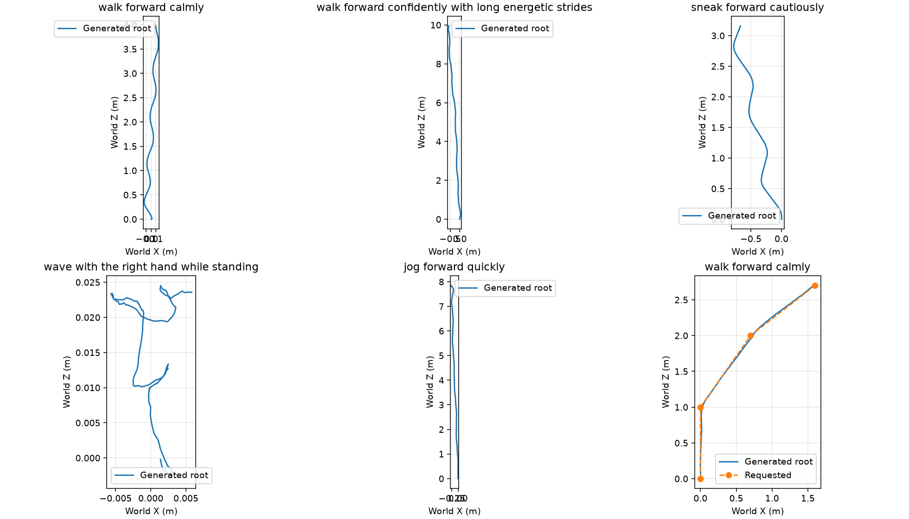
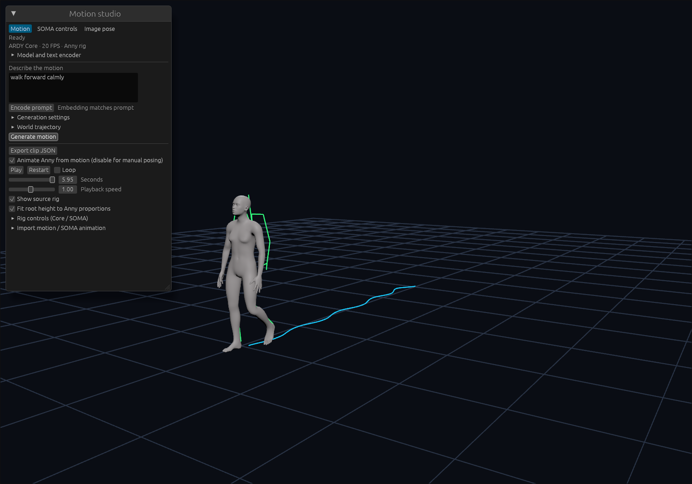
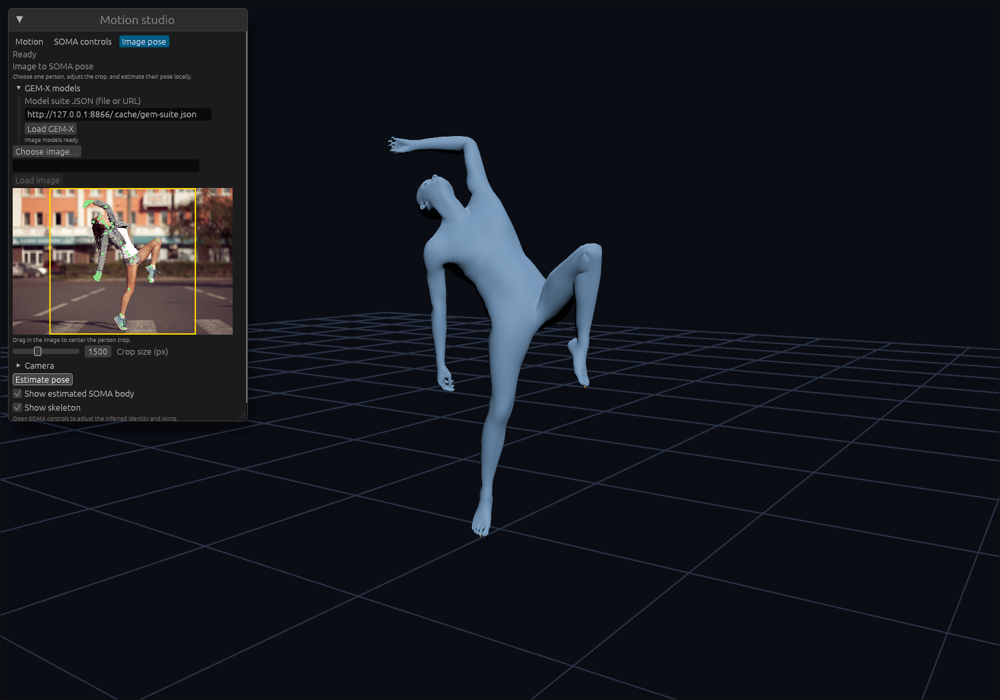
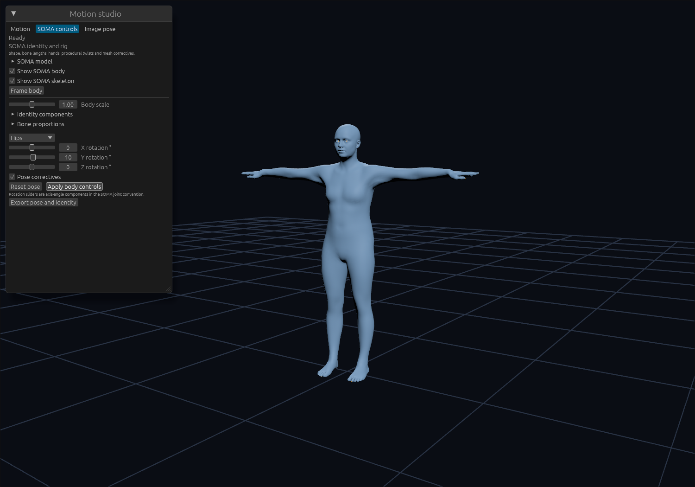

# Portable text, motion, SOMA and GEM-X qualification

These are actual checkpoint runs on native WGPU and hardware browser WebGPU.
Inference uses Rust/Burn throughout. Python/ONNX/Torch produce independent
offline reference fixtures; the browser server serves static files only.

Hardware and input provenance are in [environment.json](environment.json).
The GPU was an RTX PRO 6000 Blackwell (97,887 MiB, driver 610.43.02), with
Chromium 153.0.8010.12, Burn 0.21.0, Bevy 0.19.1 and a single wgpu 29.0.4.
This shared workstation was not isolated for benchmarking. Timings below
exclude model loading unless explicitly identified, include output readback,
and do not measure Bevy rendering, mobile devices or integrated GPUs.

## Numerical results

| Path | Independent reference and coverage | Result |
| --- | --- | --- |
| Llama 3 / LLM2Vec | Released Q4F/FP16 ONNX, five prompts with both causal-export and bidirectional masks | Minimum cosine similarity 0.9999984; [native](text-native.json), [browser](text-browser.json) |
| ARDY + Anny | Full checkpoint/window parity and bind-aware retargeting | [Earlier checkpoint evidence](../ardy-2026-09-26/); new local Burn prompt runs below |
| Native SOMA identities | Official SOMA-X Torch: neutral, shape/pose, scale/correctives, correctives disabled | Maximum vertex coordinate error 1.44 µm native, 1.79 µm browser; [native](soma-native.json), [browser](soma-browser.json) |
| MHR | Official TorchScript, four shape/pose/expression cases | Maximum vertex coordinate error 0.92 µm; [report](mhr-native.json) |
| MHR → SOMA transfer | Official SOMA-X transfer, three cases | Maximum vertex coordinate error 0.157 mm; [report](mhr-soma-transfer-native.json) |
| GEM ViTPose | Released ONNX heatmaps | Maximum error 6.79e-7; [report](gem-vitpose-native.json) |
| SAM image backbone | Pinned official F32 Torch DINOv3 | Cosine 0.999999586, RMSE 3.07e-4, maximum 0.0283; [report](gem-sam-vision-native.json) |
| SAM iterative body decoder | Official Torch, all six feedback layers | Body-token maximum error 2.15e-6; intermediate keypoints within 0.50 µm; [report](gem-sam-decoder-native.json) |
| GEM regression decoder | Released ONNX, batch/frame shapes 1×1 and 2×8 | Feature maximum error 6.92e-6, camera 7.16e-7; [report](gem-denoiser-native.json) |
| Complete image → fitted SOMA mesh | Released ONNX plus official SAM/MHR/SOMA; same RGB image, crop and camera | Maximum vertex coordinate error 0.391 mm, joint error 0.336 mm; [native](gem-image-native.json), [browser](gem-image-browser.json) |

The image fixture is the upstream SAM 3D Body `notebook/images/dancing.jpg`,
decoded at 2250×1500 and losslessly saved as PNG. Its digest, crop and test camera intrinsics are recorded in `environment.json`. The oracle disables CUDA and
cuDNN TF32, supplies BGR to the upstream ViTPose crop helper and RGB to SAM,
and uses SAM's actual padded crop. The 2D heatmap coordinate decoding agrees
exactly; interpolation at the byte-valued input causes confidence differences
up to 0.00393. This is one real photograph plus separate synthetic stage
fixtures, not a dataset-wide pose-accuracy evaluation.

The fitted SOMA reconstruction test isolates skinning from image prediction:
feeding the reference identity/pose yields maximum vertex error 8.11 µm.
It covers the fitted twist-joint orientation bug that joint-position-only
tests miss. Canonical SOMA binding and MHR/GEM fitted binding are separate
explicit conventions. Native identities support pose correctives; the released
GEM path uses fitted binding without those canonical correctives.

Llama preserves packed Q4F weights on the GPU and expands each matrix before
F32 multiplication. This is not a fused INT4 kernel claim. Default inference
uses bidirectional LLM2Vec attention; `CausalExport` reproduces the public
ONNX graph's causal mask. Both modes are tested. Tokenization, left padding,
instruction exclusion and end-of-turn pooling are included in the comparison.

## Motion and trajectory diagnostics

[motion-runs.json](motion-runs.json) records six complete local Burn
text-to-motion runs, with five prompts and a waypoint-conditioned walk.
Each generates 120 frames at 20 FPS, seed 42 and ten diffusion steps.
[motion-quality.json](motion-quality.json) records the requests, clip digests,
forward kinematics, contacts, root/joint continuity and trajectory errors.

The energetic walk travels 10.20 m, calm walk 4.14 m, sneak 3.49 m and
standing wave 0.070 m. The waypoint walk has 0.0303 m waypoint RMSE versus
1.062 m for the unconditioned comparison. These diagnostic example gates
pass; they are not a human-rated semantic score or dataset-level FID result.

Warm native text encoding in these runs takes 0.49–0.57 s, followed by
1.29–1.39 s for 120 motion frames, including decoder and readback. The first
request is separately recorded with cold kernels. Standalone text validation
measures 0.41–0.49 s native and 0.20–0.25 s browser after warmup.

## Performance, loading and caching

| Browser path | Cold / warm / repaired part requests | Cold / warm / repaired load seconds | Largest measured WASM linear memory |
| --- | --- | --- | --- |
| Llama | 399 / 0 / 1 | 72.25 / 50.80 / 51.38 | 584.82 MiB |
| SOMA | 80 / 0 / 1 | 1.23 / 0.75 / 0.77 | 131.44 MiB |
| Full GEM suite | 1866 / 0 / 1 | 154.19 / 88.53 / 89.25 | 1224 MiB |

Warm cache runs create a fresh WASM/model instance while retaining
CacheStorage; they still decode/upload weights. Corrupt-cache runs deliberately
alter one cached part and verify exactly one replacement request. Llama's
vocabulary is paged, so these prompts access only a subset of all vocabulary
parts. GEM request counts include each bundle's URL namespace, including
identical parts under different bundle paths. Linear memory excludes GPU
allocations and the browser's own storage/cache memory.

Warm full GEM image inference takes 0.49–0.64 s in the browser and
0.63–0.66 s natively across three measured repetitions per run. It includes
ViTPose/flip testing, SAM image/iterative body features, GEM regression,
MHR-to-SOMA identity fitting, skinning and readback. Stage timings and cold
kernel costs are retained in the JSON reports.

For SOMA's `shape_pose` case with correctives, browser batch-one throughput
is 55–89 poses/s and batch-32 throughput 946–1217 poses/s across the three
cache runs. Native batch-32 measures 1069 poses/s. Identity preparation is
separate and cached; batch timings include pose evaluation, skinning and
vertex readback. Correctives-disabled timings are separately identified in
the records and are not substituted for the full-model measurements.

[artifact-inventory.json](artifact-inventory.json) records the actual tested
model/source revisions, manifest seals, object/part counts and byte sizes.
Logical Burnpack objects stay below 64 MiB and parts target 20 MiB. The
GEM suite's parts total about 7.37 GiB; the shared persistent cache budget is
8 GiB. Llama's vocabulary host cache is capped at sixteen 512-row pages
(64 MiB). GPU residency is additional; these results do not imply that every
WebGPU adapter has enough memory for the full suite.

[browser-transport.json](browser-transport.json) also verifies unavailable
storage, failing cache reads/writes, corrupt network responses and oversized
responses. Storage failure falls back to verified network reads.

## Viewer checks

- Load ARDY and Llama, type a prompt, and press Generate without separately
  encoding it. The viewer animates Anny and exports 120 frames. Exported source
  joint coordinates differ from native Burn by at most 0.727 mm, RMSE 0.060 mm:
  [viewer-motion.json](viewer-motion.json).
- Load SOMA, show its mesh, edit identity/rig controls and export the pose.
  Area-weighted normals preserve the small face and hand triangles. The
  canonical, correctives-enabled hip rotation was applied and exported:
  [viewer-soma.json](viewer-soma.json).
- Choose a photo, load the GEM suite, estimate its pose, inspect keypoints and
  the rendered SOMA mesh, reapply the fitted controls and edit body scale.
  The exported parameters agree with native Burn within 1.55e-6:
  [viewer-gem.json](viewer-gem.json).
- Image replacement invalidates the crop/preview even for identical image
  dimensions; failed or canceled input preserves the previous image. Keyboard
  shortcuts do not alter the body while typing into model/prompt fields.

The [combined-session check](viewer-combined.json) retains all GEM-X models,
loads Llama and ARDY, generates and exports 120 motion frames, then returns
to GEM-X inference without reloading models. WASM linear memory after motion
was 1220.32 MiB; GPU allocations are separate.

## Reproduction and scope

Follow [the model conversion and validation guide](../../motion.md) for the
pinned offline exporters, Burnpack packing, suite construction and native/WASM
commands. Browser runners reject software fallback adapters. Reference fixture
generation requires the original checkpoints and their applicable licenses;
model weights and the standalone source photograph are not committed here.
The viewer screenshot includes a preview of that upstream example photograph.

The manifest seals in these reports identify the tested bundles. Exporters
now additionally package LLM2Vec and DINOv3/SAM attribution assets; rebuilding
with those added metadata files changes the manifest seal without changing
tensor parts. Preserve the generated manifest when deploying any rebuilt
bundle instead of copying a seal from this historical report.

[Local release checks](local-checks.json) passed 28 workspace tests, native
all-target/tool-feature Clippy, WASM model checks and the Bevy build, Python
conversion tests, and all nine package dry runs.

Model-free CI covers contracts, corruption handling, geometry/retargeting,
token/pooling boundaries, crop/channel/flip behavior, fitted twist orientation,
image replacement and tiny-triangle normals. Full-checkpoint tests require the
downloaded assets and an actual GPU. GEM implements the released fast
single-frame regression path for a supplied person crop. Optional 50-step
diffusion, automatic person detection and video tracking are not part of this
qualification.
